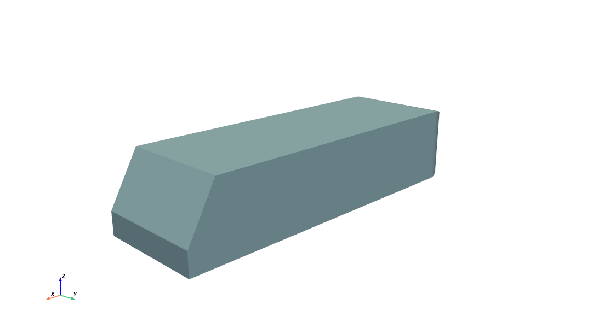

.. _datasets-ahmed:

AhmedML Dataset
===========================

The AhmedML dataset is a publicly available dataset `licensed as CC BY-SA 4.0 <https://caemldatasets.s3.amazonaws.com/ahmed/dataset/LICENSE.txt>`_ and distributed separately to MLSimKit. It is a collection of high-fidelity CFD simulations showing different geometric variants of a body for automotive aerodynamics modeling. Please see the `README <https://caemldatasets.s3.amazonaws.com/ahmed/dataset/README.txt>`_ for additional details.

Downloading the training data (45G)
------------------------------------

The dataset is hosted in an S3 bucket.

Use the following `AWS CLI <https://docs.aws.amazon.com/cli/latest/userguide/getting-started-install.html>`_ command to download the data required for the training tutorials:

.. code-block:: shell

    aws s3 sync s3://caemldatasets/ahmed/dataset /path/to/dataset \
        --exclude "*" \
        --include "run_*/ahmed*.stl" \
        --include "run_*/images/*" \
        --include "run_*/boundary*.vtp" \
        --include "run_*/force_mom_*.csv"

Replace ``/path/to/dataset`` to your own directory. 

The :ref:`Surface<tutorial-surface-ahmed-data-access>` tutorial has a step to download a smaller subset of data.
The entire dataset includes high-resolution meshes not required for training. 

.. _datasets-ahmed-understanding:

Understanding the Dataset
-------------------------

The dataset contains 500 cases, each representing a unique geometry variant.  The cases are organized into separate folders named ``run_1`` to ``run_500``, one for each simulation case.
The variability in geometry across the 500 cases leads to a diverse set of flow physics, making this dataset well-suited for machine learning model development.

Within each run folder is a standard set of files:

.. code-block:: shell

    run_1/
    ├── ahmed.stl  
    ├── boundary_1.vtp
    ├── force_mom_1.csv
    ├── force_mom_varref_1.csv
    ├── geo_parameters_1.csv
    ├── images
    │   ├── CpT
    │   │   ├── run_*.png
    │   ├── UxMean
    │   │   ├── run_*.png
    ├── slices
    │   ├── slice_*.vtp         
    └── volume_1.vtu

- ``ahmed_<run #>.stl`` - The surface geometry definition in STL format
- ``boundary_<run #>.vtp`` - Simulation results on the surface 
- ``volume_<run #>.vtu`` - Volumetric simulation outputs
- ``force_mom_<run #>.csv`` - Time-averaged force and moment coefficients
- ``force_mom_varref_<run #>.csv`` - Time-averaged force and moment coefficients using unique reference area per geometry
- ``images`` - Folder containing slice images through the volume
- ``slices`` - Folder containing slice vpt files rotated around the x, y, and z axes

The slice images show simulation variables like pressure and velocity captured on 2D planes along the X, Y and Z axes. Multiple views are available.

Slice Image Views
-----------------
The ``images`` folder within each case contains subfolders organizing the slice images by simulation output variable.

Within each variable folder (e.g. ``CpT``, ``UxMean``), there are multiple image sets showing different sliced views through the volume.

The main image sets are:

**X-Axis Slices** 

Filename pattern: ``run_*-X-*.png``

These are slices along the X-axis, showing the YZ-plane at different X positions. Useful for visualizing the flow as it passes over the geometry from front to back.

**Y-Axis Slices**

Filename pattern: ``run_*-Y-*.png`` 

Slices along the Y-axis, showing the XZ-plane. Provides a top-down view of the geometry.

**Z-Axis Slices** 

Filename pattern: ``run_*-Z-*.png``

Slices along the Z-axis, showing the XY-plane. Gives a side view at different heights.

