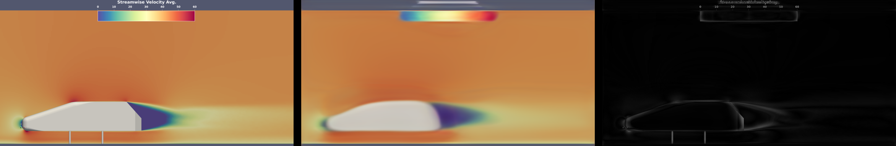

.. _tutorial-slices-windsor-training:

Training Slice Prediction on the WindsorML Dataset
===================================================================

This section guides you through the steps to train a Slice prediction model on the :ref:`datasets-windsor`. If you haven't already accessed the WindsorML dataset, :ref:`follow these instructions <tutorial-slices-windsor-data-access>`. 

The Slice Prediction pipeline consists of the following main steps:

1. Preprocess the data and create manifests
2. Train the image autoencoder model
3. Process the mesh data and link it with the image data
4. Train the final prediction model
5. Test the trained model on a validation dataset

Before we begin, navigate to the ``tutorials/slices/windsor`` folder, which contains the necessary scripts and configuration files for this tutorial:

.. code-block:: shell

    tutorials/slices/windsor/
    ├── download-dataset
    ├── logging.yaml
    ├── prediction.yaml
    ├── readme.txt
    ├── run-clean
    ├── run-create-manifest-prediction
    ├── run-create-manifest-training
    ├── run-prediction
    ├── run-training-pipeline
    └── training.yaml

The process involves creating data manifests, running the training pipeline, reviewing the results, and understanding the configuration files.

- ``download-dataset``: Script to help download the dataset from S3
- ``logging.yaml``: Configuration file for logging settings.
- ``prediction.yaml``: Configuration file for the prediction step.
- ``training.yaml``: Configuration file for the training pipeline.
- ``run-create-manifest-training``: Script to create the training data manifest.
- ``run-create-manifest-prediction``: Script to create the prediction data manifest.
- ``run-training-pipeline``: Script to run the entire training pipeline.
- ``run-prediction``: Script to run the prediction step on new geometries.
- ``run-clean``: Script to clean up the output directories.
- ``readme.txt``: Additional instructions and information about the tutorial.

Let's go through each step in detail.

.. _tutorial-slices-windsor-training-manifest-creation:

Creating the Manifest
---------------------

A manifest describes the paths to a dataset and is used to share data between tasks. The manifest format is `JSON Lines <https://jsonlines.org/>`_ where each line corresponds to one simulation run.

.. note::
   Ensure the dataset is on a filesystem: run ``./download-dataset /path/to/windsor/dataset`` or :ref:`follow these instructions <tutorial-slices-windsor-data-access>`.

The ``run-create-manifest`` script generates the required manifest for the WindsorML dataset. To create the manifest, run the script pointing to your dataset location:

.. code-block:: shell

   ./run-create-manifest-training /path/to/windsor/dataset

This will generate one manifest:

- ``outputs/training/trainining.manifest``: Lists geometry and image files for the training dataset

You can customize the manifests by modifying variables in the ``run-create-manifest-training`` script:

.. code-block:: shell

   #!/bin/bash

   # ...

   # The slice type to train on. Windsor has: pressureavg  rstress_xx  rstress_yy  rstress_zz  velocityxavg
   slices_folder="velocityxavg"		

   # Check the slices folder within Windsor for the possible view files.
   image_files="view1_constz*.png"

   # Get a list of run folders for training 
   train_run_folders=($(ls -d "$dataset_prefix/run_"*))

   # ...

A manifest is a JSON Lines (``.manifest``) file that lists the paths to the data files and their associated slice image files. Each line in the manifest represents a single data file entry, containing the following keys:

- ``"geometry_files"``: A list of relative or absolute paths to the geometry files (e.g., ``.stl``)
- ``"slices_uri"``: A list of relative or absolute paths to the slice images associated with the geometry (optional for prediction/inference manifests)

Here's an example manifest entry:

.. code-block:: json

   {
     "geometry_files": [
       "file:///mnt/caemldatasets/windsor/dataset/run_99/windsor_99.stl"
     ],
     "slices_uri": [
       "file:///mnt/caemldatasets/windsor/dataset/run_99/images/velocityxavg/view1_constz_scan_0000.png",
       "file:///mnt/caemldatasets/windsor/dataset/run_99/images/velocityxavg/view1_constz_scan_0001.png",
       "file:///mnt/caemldatasets/windsor/dataset/run_99/images/velocityxavg/view1_constz_scan_0002.png",
       "..."
     ]
   }

This entry lists the paths to geometry files (``windsor_99.stl``) and the associated slice image files (``view1_constz_scan_*.png``).

.. note::

   By default, training is configured to reproduce accurate results on the full dataset and will take over an hour to complete training. Instead, if you want to first verify end-to-end on the WindsorML dataset, edit ``training.yaml`` so the number of epochs for ``train-image-encoder`` and ``train-prediction`` are both small e.g, 10. Then reduce the dataset size by editing ``run-create-manifest-training`` to include fewer runs and recreate the training manifest. 

Running the Pipeline
--------------------

With the manifests created and configuration files in place, you can run the full Slice prediction pipeline using the provided scripts:

Run the training pipeline:

.. code-block:: shell

   ./run-training-pipeline

The script executes the necessary commands using the ``training.yaml`` configuration file.

You can also run individual commands manually if needed:

.. code-block:: shell

   mlsimkit-learn --config trainining.yaml slices <command>

For example, you may want to skip the preprocessing step when you are training with new parameters.

.. note::
   
   On older MacOS hardware, you may see the error ``Cannot convert a MPS Tensor to float64 dtype``. If so, force CPU by specifying ``device: cpu`` for train commands in the configuration file. 
   
   In general, please see the :ref:`Troubleshooting <troubleshooting>` guide for possible errors if commands do not work.

Training with Multiple GPUs
---------------------------

MLSimKit integrates training with `Hugging Face Accelerate <https://huggingface.co/docs/accelerate/index>`_ to enable and launch multi-GPU training. This can significantly speed up the training process when multiple GPUs are available.

To enable multi-GPU training, you can use the ``--multi-gpu`` flag when running the training script:

.. code-block:: shell

   ./run-training-pipeline --multi-gpu

.. note::

   The availability of multi-GPU training depends on your hardware setup and the number of GPUs available on your machine or cluster. If multiple GPUs are not available, the training pipeline will continue to run on a single GPU or CPU.

The script calls ``mlsimkit-accelerate`` which is our thin wrapper around ``accelerate launch`` that runs multiple training processess. By default, ``accelerate launch`` will automatically set a configuration for various platforms. Refer to the `accelerate launch tutorial <https://huggingface.co/docs/accelerate/basic_tutorials/launch#using-accelerate-launch>`_ for a quick overview. For the complete list of configuration options, see ``accelerate launch --help``. 

You may pass additional arguments to Accelerate using ``--launch-args``:

.. code-block:: shell

   mlsimkit-accelerate --config <config.yaml> slices train-image-encoder \ 
    --launch-args <additional accelerate launch args>

For example, the following limits to 2 GPUs:

.. code-block:: shell

   mlsimkit-accelerate --config <config.yaml> slices train-image-encoder \
    --launch-args --num_processes 2

We recommend using ``mlsimkit-accelerate`` for simplicity but you may invoke ``accelerate launch`` directly like this:

.. code-block:: shell

    accelerate launch --no-python \
        mlsimkit-learn --accelerate-mode slices train-image-encoder

.. warning:: 
    Use ``accelerate launch`` for training commands only. Non-training commands do not support multiple GPU processors. 

    Always specify ``--accelerate-mode`` with ``accelerate launch`` to hide duplicate logs and avoid logging race conditions on start.
   
    Do not use ``--accelerate-mode`` outside ``accelerate launch``.

Reviewing Results
------------------

During Training
~~~~~~~~~~~~~~~

The training pipeline generates several types of image files to help you monitor the performance of the image autoencoder model. These files are grouped by the run ID (e.g., ``slice-group-0``, ``slice-group-2``, etc.) and can be found in the ``outputs/training/ae/inference_output/images/`` directory.

- ``*-original-*.png``: The original input slice images from the dataset
- ``*-reconstructed-*.png``: The reconstructed slice images from the autoencoder model
- ``*-error-*.png``: The error between the original and reconstructed slices, highlighting the differences
- ``*-combined-*.png``: A combined view showing the original, reconstructed, and error images side-by-side for easy comparison

The combined images provide a convenient way to assess the autoencoder's reconstruction quality. Areas with high error (bright colors in the ``error`` image) indicate regions where the reconstructed slice deviates significantly from the original input.

You can also find quantitative metrics summarizing the reconstruction accuracy in the ``outputs/training/ae/inference_output/results.jsonl`` file.

During Testing
~~~~~~~~~~~~~~

The testing step generates images showing the slice predictions made by the trained model. These images are located in the ``outputs/training/predictions/prediction/images/`` directory.  This step can also be thought as prediction with ground truth.  The test manifest has access to the ground truth simulation data for the prediction geometries and should include the following files in the output:

- ``*-prediction-*.png``: The predicted slice images from the trained model
- ``*-original-*.png``: The original input slice images from the dataset
- ``*-error-*.png``: The error between the original and predicted slices, highlighting the differences
- ``*-combined-*.png``: A combined view showing the original, predicted, and error images side-by-side for easy comparison

Configuration Files
-------------------

The Slice prediction pipeline is configured using separate YAML files for training and prediction:

**training.yaml**

This file controls the training pipeline, including data preprocessing, training the image encoder, training the prediction model and testing. Some key settings include:

- ``output-dir``: Directory for storing training artifacts (models, images, metrics)
- ``slices.preprocess.manifest-uri``: Path to the training data manifest
- ``slices.train-image-encoder``: Hyperparameters for the image autoencoder model
- ``slices.train-prediction``: Hyperparameters for the final prediction model
- ``slices.predict.ae-model-path``: Path to the trained image autoencoder model
- ``slices.predict.mgn-model-path``: Path to the trained prediction model

To get an introduction to the available configuration options, use the ``mlsimkit-learn slices --help`` command and the ``--help`` option for each sub-command. This will provide an overview of the options and their purposes, which can be helpful when configuring the training and prediction pipelines.

.. note::

   If you want to start tuning training parameters while keeping the same dataset, you can skip the preprocessing step. To do this, either edit ``run-training-pipeline`` script and remove ``preprocess`` from the command or, alternatively, call ``mlsimkit-learn --config training.yaml slices ...`` subcommands directly. 

Next Steps
----------

Proceed to :ref:`tutorial-slices-windsor-prediction` tutorial to learn how to run the Slice prediction on new geometries without ground truth simulation data.

See the :ref:`user-guide-slices` for detailed information on all configuration options and how they impact model training and performance.
