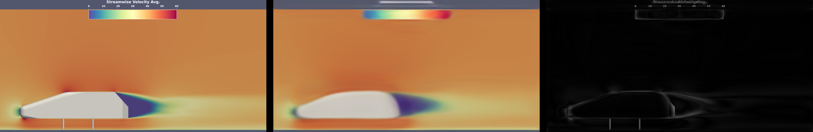

.. _quickstart-slices:

Quickstart with Slice Prediction
===================================

To get started, first make sure that:

* MLSimKit is :ref:`installed <install>`

We'll use a sample dataset to quickly show you an end-to-end workflow. 

Slice prediction is accessed via the ``mlsimkit-learn slices`` command

.. code-block:: text

    [MLSimKit] Learning Tools
    Usage: mlsimkit-learn slices [OPTIONS] COMMAND1 [ARGS]... [COMMAND2
                                 [ARGS]...]...

      Use Case: Slice Prediction

      Slice Prediction is used to predict parameters from slices for 3D geometry
      meshes... 

    Options:
      --help  Show this message and exit.

    Commands:
      preprocess             Step (1): Process input data and prepare manifests
      train-image-encoder    Step (2): Train image encoding model
      process-mesh-data      Step (3): Link the geometry and image training data
      train-prediction       Step (4): Train prediction using encoder outputs
      predict                Step (5): Predict results and evaluate performance
      inspect-image-encoder  (Debug): Evaluate image encoder performance

There are five steps to run the pipeline through preprocessing, training, and then prediction. You may run commands separately. For convenience, you can run one or more commands including the entire pipeline using YAML config files.

You may provide a config by running:

.. code-block:: shell

    mlsimkit-learn --config <config> slices <command-name> <command-name> ...

You can use the ``help`` command to see options and the definitions of hyperparameters. For example, the following command will display all hyperparameters for a training step:

.. code-block:: shell

    mlsimkit-learn slices train-image-encoder --help

Sample Dataset 
------------------------
There is a sample config and a very small sample dataset called "ahmed-sample" so you can run end-to-end quickly:

.. code-block:: shell

    src/mlsimkit/conf
    └── slices
        └── sample.yaml

    src/mlsimkit/datasets
    ├── ...
    └── ahmed-sample
        ├── downsampled_stls
        ├── slice_images 
        └── slices.manifest

External Datasets
------------------------
In addition to the sample dataset, there are tutorials to get started with publicly available datasets::

    tutorials/
    └── slices
        ├── ahmed/
        ├── drivaer/
        ├── sample/
        └── windsor/

Run the Sample 
------------------------

First, make a folder for all the outputs. Replace ``--output-dir quickstart/slices`` in the command below with your own folder location.

Second, run the entire train-predict pipeline to make predictions on the sample data:

.. code-block:: shell

           mlsimkit-learn --output-dir quickstart/slices \
            --config src/mlsimkit/conf/slices/sample.yaml \
            slices preprocess \
                   train-image-encoder --device cpu \
                   inspect-image-encoder \
                   process-mesh-data \ 
                   train-prediction --device cpu \
                   predict

Also, note that commands can be chained together.  For example, the above runs `preprocess`, `train-image-encoder`, `inspect-image-encoder`, `process-mesh-data`, `train-prediction`, and then `predict`.

Running on GPU
~~~~~~~~~~~~~~

MLSimKit automatically uses a GPU by default. To use your GPU, remove ``--device cpu`` from the previous command and run again:

.. code-block:: shell

           mlsimkit-learn --output-dir quickstart/slices \
            --config src/mlsimkit/conf/slices/sample.yaml \
            slices preprocess train-image-encoder inspect-image-encoder \
                   process-mesh-data train-prediction predict

.. note::

   On older MacOS hardware, you may see the error ``Cannot convert a MPS Tensor to float64 dtype``. If so, force CPU by specifying ``--device cpu`` for the train commands. 

   In general, please see the :ref:`Troubleshooting <troubleshooting>` guide for possible errors if commands do not work.

All artifacts are written into the output directory ``--output-dir``. You may also set the output directory in the config file. Commands automatically share paths to the output artifacts such as the train model path. The sample configuration below sets some input options but most options use defaults. There are many options, which we go into detail after the quickstart.

The sample configuration ``conf/slices/sample.yaml`` looks like this:

.. code-block:: yaml

   slices:
    preprocess:
      # path is relative to mlsimkit/datasets, which is the default search path
      manifest-uri: ahmed-sample/slices.manifest

      # split the dataset into three
      train-size: 0.6
      valid-size: 0.2
      test-size: 0.2

    train-image-encoder:
      batch-size: 1   # small for quickstart sample, use larger normally. See user guide.

    train-prediction:
      epochs: 10      # low number for sample quickstart
      batch-size: 1   # small for quickstart sample, use larger normally. See user guide.

.. note::
   A "manifest" describes the paths to a dataset and is used to share data between tasks for a particular prediction use case like Slices. For now, know that ``ahmed-sample/slices.manifest`` references a small dataset packaged with MLSimKit.

You will see console logging something like this:

.. code-block:: shell

  [INFO] [MLSimKit] Learning Tools
  [INFO] Package Version: 0.2.3.dev3+gaf49957.d20240808
  [INFO] Running command 'preprocess'
  [INFO] Preprocessing manifest '/home/ubuntu/mlsimkit/src/mlsimkit/datasets/ahmed-sample/slices.manifest'
  [INFO] Image data written to '/home/ubuntu/mlsimkit/quickstart/slices/slices/slice-group-0.npy'
  [INFO] Image data written to '/home/ubuntu/mlsimkit/quickstart/slices/slices/slice-group-1.npy'
  [INFO] Image data written to '/home/ubuntu/mlsimkit/quickstart/slices/slices/slice-group-2.npy'
  [INFO] Image data written to '/home/ubuntu/mlsimkit/quickstart/slices/slices/slice-group-3.npy'
  [INFO] Image data written to '/home/ubuntu/mlsimkit/quickstart/slices/slices/slice-group-4.npy'
  [INFO] Image data written to '/home/ubuntu/mlsimkit/quickstart/slices/slices/slice-group-5.npy'
  [INFO] Image data written to '/home/ubuntu/mlsimkit/quickstart/slices/slices/slice-group-6.npy'
  [INFO] Manifest '/home/ubuntu/mlsimkit/quickstart/slices/slices-copy.manifest' written (7 records)
  [INFO] Splitting manifest into train-size=0.6 valid-size=0.2 test-size=0.2
  [INFO] Manifest '/home/ubuntu/mlsimkit/quickstart/slices/train.manifest' written (4 records)
  [INFO] Manifest '/home/ubuntu/mlsimkit/quickstart/slices/validate.manifest' written (1 records)
  [INFO] Manifest '/home/ubuntu/mlsimkit/quickstart/slices/test.manifest' written (2 records)
  [INFO] Running command 'train-image-encoder'
  [INFO] Training state configuration: {"Distributed": "no", "Num processes": 1, "Process index": 0, "Local process index": 0, "Device": "cuda", "Mixed precision": "no"}
  [INFO] Training started for 'model'
  [INFO] Train dataset size: 4
  [INFO] Validation dataset size: 1
  [INFO] Training:   0%|                                                          | 0/5 [00:00<?, ?epochs/s ]
  [INFO] Epoch 0: train loss = 52558.26172; validation loss = 39234.75781; best validation loss = inf
  [INFO] Model saved to '/home/ubuntu/mlsimkit/quickstart/slices/ae/training_output/best_model.pt'
  [INFO] Model saved to '/home/ubuntu/mlsimkit/quickstart/slices/ae/training_output/checkpoint_models/model_epoch0.pt'
  [INFO] Training:  20%|██████████                                        | 1/5 [00:01<00:07,  1.90s/epochs ]
  [INFO] Epoch 1: train loss = 57753.22656; validation loss = 38050.39453; best validation loss = 39234.75781
  [INFO] Model saved to '/home/ubuntu/mlsimkit/quickstart/slices/ae/training_output/best_model.pt'
  [INFO] Training:  40%|████████████████████                              | 2/5 [00:02<00:03,  1.01s/epochs ]
  [INFO] Epoch 2: train loss = 54896.26172; validation loss = 45074.37891; best validation loss = 38050.39453
  [INFO] Epoch 1 had the minimum validation loss.
  [INFO] Training:  60%|██████████████████████████████                    | 3/5 [00:02<00:01,  1.42epochs/s ]
  [INFO] Epoch 3: train loss = 51979.10156; validation loss = 39109.33984; best validation loss = 38050.39453
  [INFO] Epoch 1 had the minimum validation loss.
  [INFO] Training:  80%|████████████████████████████████████████          | 4/5 [00:02<00:00,  1.84epochs/s ]
  [INFO] Epoch 4: train loss = 48421.11719; validation loss = 39321.71875; best validation loss = 38050.39453
  [INFO] Epoch 1 had the minimum validation loss.
  [INFO] Model saved to '/home/ubuntu/mlsimkit/quickstart/slices/ae/training_output/last_model.pt'
  [INFO] Training: 100%|██████████████████████████████████████████████████| 5/5 [00:02<00:00,  1.97epochs/s ]
  [INFO] Training time for model: 2.720 seconds / 0.045 minutes
  [INFO] Minimum validation loss: 38050.39453
  [INFO] Minimum train loss: 48421.11719
  [INFO] Training Completed
  [INFO] Total training time: 2.730 seconds / 0.046 minutes
  [INFO] Running command 'inspect-image-encoder'
  [INFO] Running inference on model '/home/ubuntu/mlsimkit/quickstart/slices/ae/training_output/best_model.pt'
  [INFO] Generating images frames=10 channels=3 size=(128, 128)
  [INFO] Result metrics: {'mse': 0.09836520999670029, 'mae': 0.2959270179271698, 'mape': 1.5198930501937866, 'msle': 0.04955117776989937, 'psnr': 7.8740850350534455}
  [INFO] Result metrics: {'mse': 0.09724471718072891, 'mae': 0.29339802265167236, 'mape': 1.5099842548370361, 'msle': 0.049076326191425323, 'psnr': 7.9238399347884805}
  [INFO] Result metrics: {'mse': 0.09833560138940811, 'mae': 0.2956932485103607, 'mape': 1.5212063789367676, 'msle': 0.049564674496650696, 'psnr': 7.875391758675056}
  [INFO] Result metrics: {'mse': 0.0982661321759224, 'mae': 0.29574644565582275, 'mape': 1.5169732570648193, 'msle': 0.049490440636873245, 'psnr': 7.878460798940074}
  [INFO] Images written to '/home/ubuntu/mlsimkit/quickstart/slices/ae/inference_output/images'
  [INFO] Results written to '/home/ubuntu/mlsimkit/quickstart/slices/ae/inference_output/results.jsonl'
  [INFO] Running command 'process-mesh-data'
  [INFO] Processing manifest '/home/ubuntu/mlsimkit/quickstart/slices/train.manifest'
  [INFO] Encoding written '/home/ubuntu/mlsimkit/quickstart/slices/ae/inference_output/geometry-group-5.pt'
  [INFO] Encoding written '/home/ubuntu/mlsimkit/quickstart/slices/ae/inference_output/geometry-group-3.pt'
  [INFO] Encoding written '/home/ubuntu/mlsimkit/quickstart/slices/ae/inference_output/geometry-group-4.pt'
  [INFO] Encoding written '/home/ubuntu/mlsimkit/quickstart/slices/ae/inference_output/geometry-group-2.pt'
  [INFO] Manifest '/home/ubuntu/mlsimkit/quickstart/slices/train.manifest' written (4 records)
  [INFO] Processing manifest '/home/ubuntu/mlsimkit/quickstart/slices/validate.manifest'
  [INFO] Encoding written '/home/ubuntu/mlsimkit/quickstart/slices/ae/inference_output/geometry-group-0.pt'
  [INFO] Manifest '/home/ubuntu/mlsimkit/quickstart/slices/validate.manifest' written (1 records)
  [INFO] Running command 'train-prediction'
  [INFO] Training state configuration: {"Distributed": "no", "Num processes": 1, "Process index": 0, "Local process index": 0, "Device": "cuda", "Mixed precision": "no"}
  [INFO] Training started for 'model'
  [INFO] Train dataset size: 4
  [INFO] Validation dataset size: 1
  [INFO] Training:   0%|                                                         | 0/10 [00:00<?, ?epochs/s ]
  [INFO] Epoch 0: train loss = 3.07725; validation loss = 0.82969; best validation loss = inf
  [INFO] Model saved to '/home/ubuntu/mlsimkit/quickstart/slices/mgn/training_output/best_model.pt'
  [INFO] Model saved to '/home/ubuntu/mlsimkit/quickstart/slices/mgn/training_output/checkpoint_models/model_epoch0.pt'
  [INFO] Training:  10%|████▉                                            | 1/10 [00:00<00:06,  1.30epochs/s ]
  [INFO] Epoch 1: train loss = 0.61467; validation loss = 0.38669; best validation loss = 0.82969
  [INFO] Model saved to '/home/ubuntu/mlsimkit/quickstart/slices/mgn/training_output/best_model.pt'
  [INFO] Training:  20%|█████████▊                                       | 2/10 [00:01<00:04,  1.87epochs/s ]
  [INFO] Epoch 2: train loss = 0.26822; validation loss = 0.13899; best validation loss = 0.38669
  [INFO] Model saved to '/home/ubuntu/mlsimkit/quickstart/slices/mgn/training_output/best_model.pt'
  [INFO] Training:  30%|██████████████▋                                  | 3/10 [00:01<00:03,  2.21epochs/s ]
  [INFO] Epoch 3: train loss = 0.10167; validation loss = 0.06073; best validation loss = 0.13899
  [INFO] Model saved to '/home/ubuntu/mlsimkit/quickstart/slices/mgn/training_output/best_model.pt'
  [INFO] Training:  40%|███████████████████▌                             | 4/10 [00:01<00:02,  2.43epochs/s ]
  [INFO] Epoch 4: train loss = 0.05216; validation loss = 0.05481; best validation loss = 0.06073
  [INFO] Model saved to '/home/ubuntu/mlsimkit/quickstart/slices/mgn/training_output/best_model.pt'
  [INFO] Training:  50%|████████████████████████▌                        | 5/10 [00:01<00:01,  2.59epochs/s ]
  [INFO] Epoch 5: train loss = 0.04968; validation loss = 0.04911; best validation loss = 0.05481
  [INFO] Model saved to '/home/ubuntu/mlsimkit/quickstart/slices/mgn/training_output/best_model.pt'
  [INFO] Training:  60%|█████████████████████████████▍                   | 6/10 [00:02<00:01,  2.70epochs/s ]
  [INFO] Epoch 6: train loss = 0.04377; validation loss = 0.03427; best validation loss = 0.04911
  [INFO] Model saved to '/home/ubuntu/mlsimkit/quickstart/slices/mgn/training_output/best_model.pt'
  [INFO] Training:  70%|██████████████████████████████████▎              | 7/10 [00:02<00:01,  2.78epochs/s ]
  [INFO] Epoch 7: train loss = 0.02903; validation loss = 0.02640; best validation loss = 0.03427
  [INFO] Model saved to '/home/ubuntu/mlsimkit/quickstart/slices/mgn/training_output/best_model.pt'
  [INFO] Training:  80%|███████████████████████████████████████▏         | 8/10 [00:02<00:00,  2.85epochs/s ]
  [INFO] Epoch 8: train loss = 0.02037; validation loss = 0.01951; best validation loss = 0.02640
  [INFO] Model saved to '/home/ubuntu/mlsimkit/quickstart/slices/mgn/training_output/best_model.pt'
  [INFO] Training:  90%|████████████████████████████████████████████     | 9/10 [00:03<00:00,  2.91epochs/s ]
  [INFO] Epoch 9: train loss = 0.01788; validation loss = 0.01563; best validation loss = 0.01951
  [INFO] Model saved to '/home/ubuntu/mlsimkit/quickstart/slices/mgn/training_output/best_model.pt'
  [INFO] Model saved to '/home/ubuntu/mlsimkit/quickstart/slices/mgn/training_output/last_model.pt'
  [INFO] Training: 100%|████████████████████████████████████████████████| 10/10 [00:03<00:00,  2.59epochs/s ]
  [INFO] Training time for model: 3.886 seconds / 0.065 minutes
  [INFO] Minimum validation loss: 0.01563
  [INFO] Minimum train loss: 0.01788
  [INFO] Training Completed
  [INFO] Total training time: 3.886 seconds / 0.065 minutes
  [INFO] Running command 'predict'
  [INFO] Predicting images frames=10 channels=3 size=(128, 128)
  [INFO] Predicting '['/home/ubuntu/mlsimkit/src/mlsimkit/datasets/ahmed-sample/downsampled_stls/ahmed_2_downsampled.stl']'...
  [INFO] Comparing predictions to '/home/ubuntu/mlsimkit/quickstart/slices/slices/slice-group-1.npy'
  [INFO] Result metrics: {'mse': 0.09749293327331543, 'mae': 0.29415807127952576, 'mape': 1.5071260929107666, 'msle': 0.04913759604096413, 'psnr': 7.912767988920114}
  [INFO] Predicting '['/home/ubuntu/mlsimkit/src/mlsimkit/datasets/ahmed-sample/downsampled_stls/ahmed_7_downsampled.stl']'...
  [INFO] Comparing predictions to '/home/ubuntu/mlsimkit/quickstart/slices/slices/slice-group-6.npy'
  [INFO] Result metrics: {'mse': 0.09737907350063324, 'mae': 0.2937178909778595, 'mape': 1.5132616758346558, 'msle': 0.04915590211749077, 'psnr': 7.917843709358413}
  [INFO] Images written to '/home/ubuntu/mlsimkit/quickstart/slices/prediction/images'
  [INFO] Ground truth results written to '/home/ubuntu/mlsimkit/quickstart/slices/prediction/results.jsonl'

When complete, the output directory ``quickstart/slices/`` contains the data from preprocessing and training and the results for prediction. Something like this:

.. code-block:: shell

    $ tree -L 2 quickstart/slices
    quickstart/slices
    ├── ae
    │   ├── inference_output
    │   └── training_output
    ├── logs
    │   └── slices
    ├── mgn
    │   └── training_output
    ├── prediction
    │   ├── geometry-group-0-prediction.npy
    │   ├── geometry-group-5-prediction.npy
    │   ├── images
    │   ├── results.jsonl
    │   └── test-copy.manifest
    ├── slices
    │   ├── slice-group-0.npy
    │   ├── slice-group-1.npy
    │   ├── slice-group-2.npy
    │   ├── slice-group-3.npy
    │   ├── slice-group-4.npy
    │   ├── slice-group-5.npy
    │   └── slice-group-6.npy
    ├── slices-copy.manifest
    ├── train.manifest
    ├── validate.manifest
    └── test.manifest

Results
------------------------
You have trained a Slices model from scratch on sample data. To view image results, open the images in ``quickstart/slices/prediction/images/``. For each input geometry mesh, there are 10 slices. Each slice has the original image, predicted image, and an error image. The combined image conveniently stiches all three images together for quick viewing:

.. code-block:: shell

    $ tree quickstart/slices/prediction/images/
    quickstart/slices/prediction/images/
    ├── geometry-group-0-combined-0.png
    ├── geometry-group-0-combined-1.png
    ├── geometry-group-0-combined-2.png
    ├── geometry-group-0-combined-3.png
    ├── ...
    ├── geometry-group-0-combined-9.png
    ├── geometry-group-0-error-0.png
    ├── ...
    ├── geometry-group-0-error-9.png
    ├── geometry-group-0-original-0.png
    ├── ...
    ├── geometry-group-0-original-9.png
    ├── geometry-group-0-prediction-0.png
    ├── ...
    ├── geometry-group-0-prediction-9.png
    ├── geometry-group-1-combined-0.png
    ├── ...

The output combined images will look like the below. For the quickstart this will show inaccuracies due to reduced training data and training time:

.. image:: ../images/geometry-group-0-combined-0.png
   :width: 1000
   :alt: Image of prediction output vs original ground truth

However, the :ref:`tutorial-slices-windsor` has a much larger dataset and configuration to obtain more accurate results like this:

Next Steps
------------------------

Follow the :ref:`tutorial-slices-windsor` to train on a real large-scale dataset and make accurate predictions.

