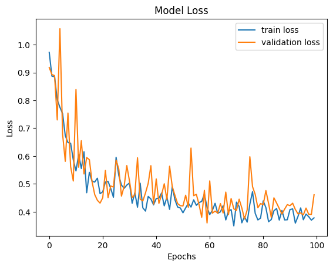
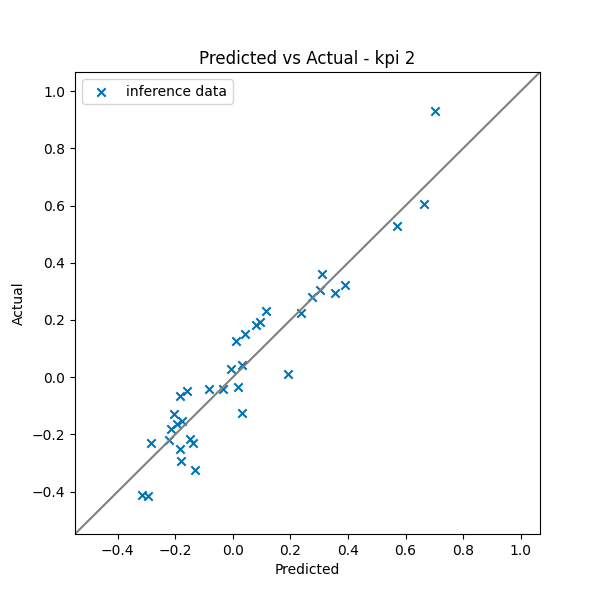

.. _user-guide-kpi:

Model User Guide -- KPI Prediction
==================================

Introduction
------------

MLSimKit uses a deep learning architecture inspired by MeshGraphNets to predict key performance indicators (KPIs) of unseen geometries. This user guide walks through how to build a model to predict KPIs of the :ref:`datasets-windsor` geometries using MLSimKit.

Key concepts:

 - Manifest: a JSON Lines file that links geometries to their KPIs, used in the preprocessing step.
 - Config: a YAML file that can be used to specify preprocessing, training, and inference settings.

How to Build a KPI Model
-------------------------

Getting the Data
~~~~~~~~~~~~~~~~
This user guide utilizes the WindsorML Body dataset. For detailed instructions on accessing and downloading the example dataset refer to :ref:`datasets-windsor`. For this user guide we assume the data is downloaded at relative path of data/windsor/.

Creating a Manifest File and a Config File
~~~~~~~~~~~~~~~~~~~~~~~~~~~~~~~~~~~~~~~~~~

.. _manifest_kpi:

Create a Manifest File
^^^^^^^^^^^^^^^^^^^^^^

To preprocess your data for training and inference steps, you'll need to create a manifest file. This manifest file should list the paths to the data files and the associated KPI values. The manifest file should be a JSON Lines (.jsonl) file, with each line representing a single data file entry. Each entry contains the following keys:

    - ``"geometry_files"``: A list of STL or VTP file paths associated with a single geometry. If one STL or VTP file represents the entire geometry, put the path of that file to the list; if multiple STL or VTP files form one geometry, put the paths to all those files in the list. The file paths can be absolute paths or relative paths (relative to the parent folder of the manifest file).
    - ``"kpi"``: A list of ground truth KPI values associated with the geometry (optional for inference manifest).

Here are examples of the manifest file, one with ground truth KPIs included and one without::

   {"geometry_files": ["data/windsor/dataset/run_0/windsor_0.stl"], "kpi": [0.2818169578178322, 0.0008234405065462456, 0.48822197919945154, -0.07294317299334006]}
   {"geometry_files": ["data/windsor/dataset/run_1/windsor_1.stl"], "kpi": [0.32251110051821463, -0.059431832381329826, -0.061135997912917385, -0.04094381732630274]}
    ::

   {"geometry_files": ["data/windsor/dataset/run_0/windsor_0.stl"]}
   {"geometry_files": ["data/windsor/dataset/run_1/windsor_1.stl"]}

To automatically generate a manifest file for WindsorML dataset, you can use the following command:

.. code-block:: shell

    mlsimkit-manifest create data/windsor/dataset/run_* \
   -m "manifest.jsonl" \
   -f "name=geometry_files,file_glob=*.stl" \
   -d "name=kpi,file_regex=force_mom_\d+\.csv,columns=cd cs cl cmy"

This produces ``manifest.jsonl`` at the current working directory.

.. _config_kpi:

Create a Config File
^^^^^^^^^^^^^^^^^^^^

To run preprocessing, training, and inference, you can provide the configurations either in an input config file or via the command-line interface (CLI). Here is an example config file:

.. code-block:: shell

    logging:
      level: info

    output_dir: <output_directory>

    kpi:
      manifest_uri: <manifest_file_path>

Replace ``<output_directory>`` with the directory where you want to save the outputs, and  ``<manifest_uri>`` with the path to your manifest file created in the :ref:`previous step <manifest_kpi>`. You can modify other configuration parameters discussed in the following sections by adding or updating their values in the configuration file. This allows you to override the default settings as per your requirements.

.. _preprocess_kpi:

Preprocessing
~~~~~~~~~~~~~

KPI prediction model predicts KPIs directly from a 3D geometry mesh. The first step is to preprocess the geometry files and KPI values, converting them into data objects (``.pt``) that can be easily consumed by the PyTorch deep learning framework. MLSimKit supports preprocessing STL and VTP file formats.

Run the following command to preprocess the data, replacing ``<config_file_path>`` with the path to the config file created in the :ref:`previous step <config_kpi>`:

.. code-block:: shell

    mlsimkit-learn --config <config_file_path> kpi preprocess

Preprocessing of the 355 runs takes around 3 minutes on AWS g5.2xlarge (cpu=8) instance. One ``.pt`` file per run is written to ``<output_directory>/preprocessed_data/`` . During preprocessing, logs are printed in the console and also saved to ``preprocessing.log``. Preprocessing splits the processed data files into three datasets for training, validation and testing. These datasets are written to manifests in the ``<output_directory>``. You can modify the percentage of data in each dataset via the split settings in the config or via command line arguments. For example,

.. code-block:: shell

   kpi:
      preprocess:
        train-size: 0.7
        valid-size: 0.1
        test-size: 0.2            

After preprocessing the data, you can proceed to training or run inference with the KPI prediction model.

.. _train_kpi:

Training
~~~~~~~~

The training step is where the machine learning model learns the relationship between geometries and KPIs. It takes the preprocessed data as input and produces PyTorch model files as output. The model files can then be used to make predictions in the :ref:`next step - inference <inference_kpi>`.

There are a number of hyper-parameters associated with model training, and all of them have default values. If you choose to use values other than the default ones, you can specify them in the :ref:`config file <config_kpi>` or via command line arguments. To do it in the config file, simply add a “train” section along with the hyper-parameter names and values. Here is an example.

.. code-block:: shell

    train:
        output_kpi_indices: "2"
        epochs: 100
        pooling_type: max
        opt:
          learning_rate: 0.003

In this example, three hyper-parameters are adjusted:

  - ``output_kpi_indices`` is set to ``"2"`` to indicate the model would only learn to predict the third KPI provided in the :ref:`manifest <manifest_kpi>`. 
  - ``epochs`` determines the number of times the dataset is passed through the neural network during training. The larger the number of epochs, the longer the model training time. A value that is too small though may lead to models that have not fully learned.
  - ``pooling_type`` controls the type of pooling that is done on the 2nd to last layer of the MGN model for graph level predictions.  There are two options (``mean`` and ``max``) with ``mean`` being the default.  Generally, ``mean`` is less prone to overfitting but can take longer to train (requires more epochs) than ``max``.
  - ``learning_rate`` stands for learning rate, which controls how fast the model learns. With a larger learning rate,  the number of epochs can typically be smaller, as the neural network makes bigger updates with every data point. A learning rate that is too large, however, can lead to poor performing models.  Note that ``learning_rate`` is one of the optimizer settings. Thus, it should be added under ``opt``.

To see the full list of training hyper-parameters and their definitions, run the command ``mlsimkit-learn kpi train --help``.

Once the config file is ready, run the following command to start training.

.. code-block:: shell

    mlsimkit-learn --config <config_file_path> kpi train

Training on the WindsorML dataset takes around 11 minutes on an AWS g5.2xlarge instance (355 simulation runs, 100 epochs at ~6.5s/epoch) and about 5 minutes using four GPUs on a g5.12xlarge instance (~3s/epoch). During training, the training loss and validation loss of each epoch are printed in the console and also saved in the log file located at ``<output_directory>/logs/kpi/training.log``.

The training step produces a number of output files (see the full list at the end of this section) in the folder ``<output_directory>/training_output/``. Among them, there are model checkpoints including ``best_model.pt`` which by default will be used in the inference step to make predictions on unseen data. It is the model that has the lowest validation error.

The model training loss plots (original scale: ``model_loss.png``; log scale: ``model_loss_log.png``) are typically useful to look at. Training losses and validation losses should be gradually decreasing until no longer decreasing. The gap between training losses and validation losses shouldn’t be too big. If it’s not the case, the model is likely not going to perform well, and hyper-parameter values and/or training data may need to be adjusted.

The list of training output files will look something like this::

    "training_output/model_loss.png",
    "training_output/model_loss_log.png",
    "training_output/model_loss.csv",
    "training_output/best_model.pt",
    "training_output/last_model.pt",
    "training_output/best_model_predictions/predicted_vs_actual_kpi2.png",
    "training_output/best_model_predictions/dataset_prediction_error_metrics.csv",
    "training_output/best_model_predictions/prediction_results.csv",
    "training_output/last_model_predictions/predicted_vs_actual_kpi2.png",
    "training_output/last_model_predictions/dataset_prediction_error_metrics.csv",
    "training_output/last_model_predictions/prediction_results.csv",
    "training_output/checkpoint_models/model_epoch0.pt",
    "training_output/checkpoint_models/model_epoch10.pt",
    "training_output/checkpoint_models/model_epoch20.pt",
    "training_output/checkpoint_models/model_epoch30.pt",
    "training_output/checkpoint_models/model_epoch40.pt",
    "training_output/checkpoint_models/model_epoch50.pt",
    "training_output/checkpoint_models/model_epoch60.pt",
    "training_output/checkpoint_models/model_epoch70.pt",
    "training_output/checkpoint_models/model_epoch80.pt",
    "training_output/checkpoint_models/model_epoch90.pt",
    "training_output/checkpoint_models/model_epoch100.pt",

.. _inference_kpi:

KPI Prediction using model inference
~~~~~~~~~~~~~~~~~~~~~~~~~~~~~~~~~~~~~~

Once model training is complete, you can run inference to get model predictions. The inference step takes the preprocessed data produced by the :ref:`preprocessing step <preprocess_kpi>` as one of the inputs.
By default, the toolkit will use the checkpoint ``<output_dir>/training_output/best_model.pt`` to make predictions and save the inference output in the folder ``<output_dir>/predictions/``.
You can overwrite the default by adding a section named "predict" to the :ref:`config file <config_kpi>` or via command line arguments.  The full list of inference related hyper-parameters can be accessed via ``mlsimkit-learn kpi inference --help``.

Run inference via the following command.

.. code-block:: shell

    mlsimkit-learn --config <config_file_path> kpi predict

The inference step produces the following output files::

    "predictions/prediction_results.csv",
    "predictions/predicted_vs_actual_kpi2.png",
    "predictions/dataset_prediction_error_metrics.csv"

``prediction_results.csv`` contains the predicted KPI(s) for each geometry in the inference data set. If the ground truth is available (which is the case here), the PNG file provides a direct view of how closely the predictions match the ground truth. The closer the dots to the line, the better the predictions. ``dataset_prediction_error_metrics.csv`` provides metrics such as MAPE, MAE, and MSE that quantify the differences between predictions and the ground truth.

To run inference on new geometries that do not have ground truth KPIs, first create a :ref:`manifest file <manifest_kpi>` based on the instructions provided and preprocess the data. To run preprocessing and inference with a single command, create a config file with the following structure:

.. code-block:: shell

    logging:
      level: info

    output_dir: <output_directory>

    kpi:
      manifest_uri: <manifest_file_path>
      preprocess:
        split-manifest: False

      predict:
        checkpoint_path: <checkpoint_model_path>
        compare-groundtruth: False   

Inference will automatically use the test manifest created during preprocessing. You can override this by passing ``manifest-path`` into the inference command.

Now run preprocessing and inference via the following command:

.. code-block:: shell

    mlsimkit-learn --config <config_file_path> kpi preprocess predict

The inference step for the data without ground truth produces the ``prediction_results.csv`` file, which contains the predicted KPI(s) for each geometry in the inference data set.
