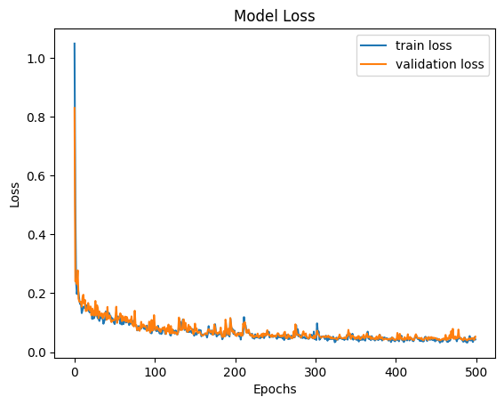

.. _user-guide-surface:

Model User Guide -- Surface Variable Prediction
======================================================

Introduction
------------

This surface variable prediction user guide dives deeper into the preprocessing, training, and predicting/inference steps and provides answers to some commonly asked questions.

.. _preprocess_surface:

Preprocessing
-------------

The preprocessing step converts the data files (e.g., ``.vtu``) and/or geometry files (e.g., ``.stl``) into data objects (``.pt``) that can be easily consumed by the PyTorch deep learning framework. Each run is corresponding to one ``.pt`` file.

Certain runs may be used for model training, while others may be used for validation or testing. The portions of the data used for training, validation, and testing can be specified via ``train-size``, ``valid-size``, and ``test-size`` arguments. MLSimKit randomly assigns runs into appropriate datasets based on the desired proportions (the default is 60% for training, 20% for validation, and 20% for testing). The ``random_seed`` argument can be used to ensure reproducibility.

Setting ``save_cell_data`` to ``True`` allows the preprocessing step to keep the mesh cell data (which is not used in model training) in the preprocessed data. It increases the sizes of the preprocessed ``.pt`` files, but the output/predicted ``.vtp`` files (produced in the predicting/inference step) generally look better with cell data included.

Preprocessing related arguments can be specified in the ``preprocess`` section of the config ``.yaml`` file or via CLI.

.. _train_surface:

Training
________

The training step is where the machine learning model learns the relationship between geometries and surface variable values. It takes the preprocessed data as input and produces PyTorch model files as output. The model files can then be used to make predictions in the :ref:`the predicting/inference step <inference_surface>`.

There are a number of hyper-parameters associated with model training (the full list can be seen by running ``mlsimkit-learn surface train --help``). You probably don't need to change the values of most of them, but a few hyper-parameters may be worth looking at, especially if your model is not performing well.

Here are some examples:
  - ``epochs`` determines the number of times the dataset is passed through the neural network during training. The larger the number of epochs, the longer the model training time. A value that is too small though may lead to models that have not fully learned.
  - ``message_passing_steps`` and ``hidden_size`` determine how complex the model gets. Larger numbers correspond to more complex/capable models which require more memories and take longer to train.
  - ``learning_rate`` controls how fast the model learns. With a larger learning rate,  the number of epochs can typically be smaller, as the neural network makes bigger updates with every data point. A learning rate that is too large, however, can lead to poor performing models.  Note that ``learning_rate`` is one of the optimizer settings. Thus, it should be added under ``opt``.
  - ``strength_x``, ``strength_y``, and ``strength_z`` control the weights associated with the three loss functions which measure the differences between predictions and ground truth at the aggregated level in X, Y, and Z directions. They exert similar effects to model training as regularization. When all of them are set to 0, the model only relies on one loss function that measures the difference between predictions and ground truth at the node level. Models trained this way don’t always produce accurate KPI predictions (KPIs are calculated from predicted surface variable values). When ``strength_x``, ``strength_y``, and ``strength_z`` are too large though, the model may not be able to capture the underlying patterns in the data effectively. When the predicted surface variables include scaler ones such as pressure, it is typically desirable to use non-zero values for ``strength_x``, ``strength_y``, and ``strength_z``.
  - ``batch_size`` determines the number of data points that are used together during one iteration of training. It can impact the model performance, training speed, and memory usage. Its ideal value is dependent on the specifics of the use case and dataset.

All training related hyper-parameter values can be specified in the ``train`` section of the config ``.yaml`` file (an example below) or via CLI.

.. code-block:: shell

    train:
        epochs: 500
        message_passing_steps: 15
        hidden_size: 32
        opt:
          learning_rate: 0.003
        batch_size: 1
        strength_x: 30
        strength_y: 1
        strength_z: 10

.. note::
    If your meshes are fine and/or have large values for ``message_passing_steps``, ``hidden_size``, and ``batch_size``, you may run into out-of-memory (OOM) issues. If that happens, you can reduce the number of nodes in your meshes, set smaller values for ``message_passing_steps``, ``hidden_size``, and ``batch_size``, or use an instance with more GPU memories.

The training step produces a number of output files in the folder ``<output_directory>/training_output/``. Among them, there are model checkpoints including ``best_model.pt`` which by default will be used in the predicting/inference step to make predictions. It is the model that has the lowest validation error.

The model training loss plots (original scale: ``model_loss.png``; log scale: ``model_loss_log.png``) are typically useful to look at. Training losses and validation losses should be gradually decreasing until no longer decreasing. The gap between training losses and validation losses shouldn’t be too big. If it’s not the case, the model is likely not going to perform well, and hyper-parameter values and/or training data may need to be adjusted.

.. _inference_surface:

Predicting/inference
____________________

Once model training is complete, you can use the model to get predictions. The predicting/inference step takes the trained model and predict on the preprocessed data produced by the :ref:`preprocessing step <preprocess_surface>`. An ``.vtp`` file can be produced for each run containing the predicted surface variable values. If ground truth exists, the difference between ground truth and predictions can also be added to the output ``.vtp`` files. The metrics quantifying the difference will be calculated as well.

Screenshots of the output ``.vtp`` files will be saved when ``save_prediction_screenshots`` is set to ``True`` (it may not work on SageMaker though). Predicting/inference related arguments can be specified in the ``predict`` section of the config ``.yaml`` file or via CLI.

.. _user_guide_surface_visualizations:

Visualizations
____________________

.. warning::
    All visualization rendering requires access to a display or a virtual display for remote machines. You may use Xvfb on remote Linux machines. See below.

3D Interactive Viewer
~~~~~~~~~~~~~~~~~~~~~

There is a simple viewer GUI provided for surface prediction. The viewer makes it easy to quickly visually compare the original (ground truth) input mesh vs. the predicted mesh across an entire dataset. The viewer uses the same config and output directories to locate the input and output files. The viewer is not intended to replace feature-rich applications like ParaView. 

By default, the training manifest will be displayed.

Start the viewer on a machine with a display by running:

.. code-block:: shell

    mlsimkit-learn --output-dir /path/to/outputs \
        --config /path/to/config \
        surface view

.. only:: html

    .. image:: ../images/quickstart-surface-viewer.gif
       :align: center

.. only:: latex or pdf

    .. image:: ../images/quickstart-surface-viewer.png
       :align: center

Screenshots tool
~~~~~~~~~~~~~~~~

You may use the ``surface view`` tool without starting a GUI application for rendering screenshots. You still need access to display or virtual display. By default, the training manifest is used for screenshots:

.. code-block:: shell

    mlsimkit-learn --output-dir /path/to/outputs \
        --config /path/to/config \
        surface view --no-gui

Screenshots during training
~~~~~~~~~~~~~~~~~~~~~~~~~~~~

It may be desirable to save screenshots automatically at the end of training. To enable screenshots during training, pass ``--save-prediction-screenshots`` to the training command. You still need access to a display:

.. code-block:: shell

    mlsimkit-learn --output-dir quickstart/surface \
        --config src/mlsimkit/conf/surface/sample.yaml \
        surface train --save-prediction-screenshots

Remote screenshots (headless Linux)
~~~~~~~~~~~~~~~~~~~~~~~~~~~~~~~~~~~
On a remote Linux machine without a display, you may use a virtual display to take screenshots. 

First install Xvfb for a virtual display::

        sudo apt-get install xvfb

Second, pass ``--start-xvfb`` during training or the view tool:

.. code-block:: shell

    mlsimkit-learn ... surface train --start-xvfb ...
    mlsimkit-learn ... surface view --start-xvfb ...

.. note::
    This virtual display can take screenshots but viewing will still require a GUI such as DCV. For more information about setting up DCV on your EC2 instance or remote machine please see the `DCV AWS documentation <https://docs.aws.amazon.com/dcv/latest/userguide/client.html>`.

Custom manifest and filtering
~~~~~~~~~~~~~~~~~~~~~~~~~~~~~

You may change the mesh files that are rendered by specifying an input manifest file to the interactive viewer and screenshot tools:

.. code-block:: shell

        mlsimkit-learn --output-dir /path/to/outputs \
            --config /path/to/config \
            surface view --manifest /path/to/manifest

Or pass the manifest lines as stdin using ``--manifest -``. We can then easily use command-line tools to filter the manifest and display
only runs we are interested in. For example, below, we include only runs 10* and 20*:
        
.. code-block:: shell

        cat /path/to/manifest | grep -E "(run_10|run_20") | mlsimkit-learn \
            --output-dir /path/to/outputs \
            --config /path/to/config \
            surface view --manifest -

